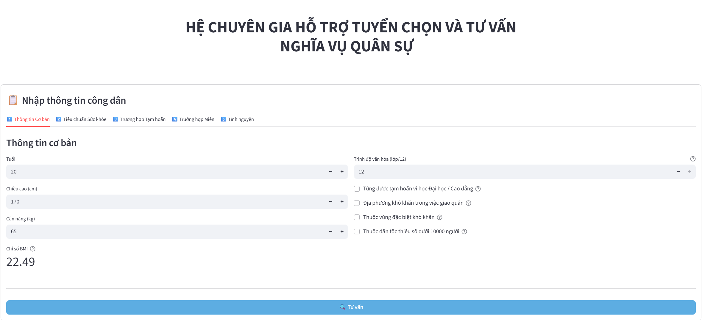
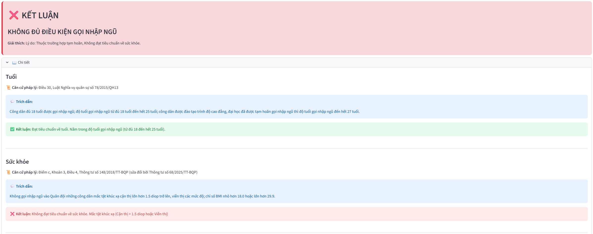
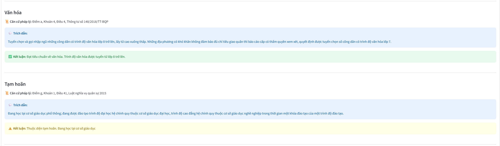
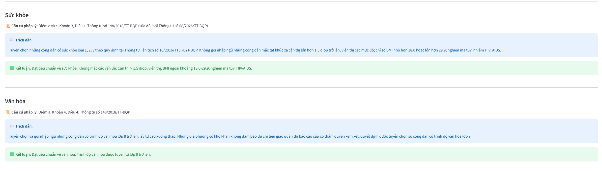
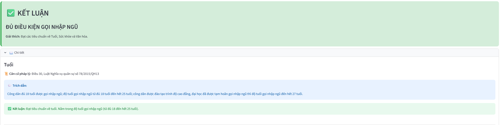

# Hệ Chuyên Gia Hỗ Trợ Tuyển Chọn và Tư Vấn Nghĩa Vụ Quân Sự



[](https://www.python.org/downloads/)
[](https://fastapi.tiangolo.com/)
[](https://streamlit.io/)
[](https://www.docker.com/)
[](LICENSE)

---

## 📋 Mục lục

- [Giới thiệu](#-giới-thiệu)
- [Đặc điểm nổi bật](#-đặc-điểm-nổi-bật)
- [Kiến trúc hệ thống](#-kiến-trúc-hệ-thống)
- [Công nghệ sử dụng](#️-công-nghệ-sử-dụng)
- [Hướng dẫn cài đặt](#-hướng-dẫn-cài-đặt)
- [Cấu trúc dự án](#-cấu-trúc-dự-án)
- [Tài liệu chi tiết](#-tài-liệu-chi-tiết)
- [Demo & Ví dụ](#-demo--ví-dụ)
- [Giấy phép](#-giấy-phép)

---

## 🎯 Giới thiệu

Hệ Chuyên Gia Hỗ Trợ Tuyển Chọn và Tư Vấn Nghĩa Vụ Quân Sự là một ứng dụng **knowledge-based expert system** được phát triển nhằm tự động hóa và minh bạch hóa quy trình tư vấn điều kiện nhập ngũ cho công dân Việt Nam. Hệ thống hoạt động như một công cụ hỗ trợ quyết định thông minh, cung cấp các đánh giá chính xác dựa trên các văn bản pháp luật hiện hành về nghĩa vụ quân sự.

### Bối cảnh ra đời

Trong bối cảnh chuyển đổi số quốc gia và hiện đại hóa hành chính công, quy trình tuyển chọn nghĩa vụ quân sự hiện nay đang đối mặt với những thách thức:

- **Phức tạp pháp lý:** Hệ thống tiêu chuẩn đa dạng về độ tuổi, sức khỏe, học vấn, hoàn cảnh gia đình
- **Khối lượng công việc lớn:** Áp lực hành chính trong việc xét duyệt hồ sơ thủ công
- **Tính nhất quán:** Khác biệt trong cách áp dụng quy định giữa các địa phương
- **Rào cản thông tin:** Công dân khó tiếp cận và hiểu đúng các quy định phức tạp

Hệ thống này được thiết kế để giải quyết các vấn đề trên bằng cách ứng dụng trí tuệ nhân tạo (AI) vào lĩnh vực tư vấn pháp luật công.


### Mục tiêu dự án

**Mục tiêu tổng quát:**
> Xây dựng một hệ chuyên gia dựa trên luật (rule-based expert system) có khả năng cung cấp các đánh giá về điều kiện nhập ngũ một cách chính xác, minh bạch và có khả năng giải thích, góp phần nâng cao hiệu quả công tác tư vấn nghĩa vụ quân sự.

**Mục tiêu cụ thể:**
1. Thu thập và phân loại tri thức từ các văn bản quy phạm pháp luật
2. Thiết kế cơ sở tri thức (Knowledge Base) cấu trúc và logic
3. Xây dựng bộ suy diễn (Inference Engine) sử dụng thuật toán Forward Chaining
4. Phát triển giao diện thân thiện cho cả người dùng cuối và cán bộ chuyên môn
5. Cung cấp cơ chế giải thích minh bạch với trích dẫn điều luật cụ thể

### Đối tượng sử dụng

| Đối tượng | Mục đích sử dụng |
|-----------|------------------|
| **Công dân** | Tra cứu và hiểu rõ nghĩa vụ quân sự của bản thân thông qua kênh thông tin minh bạch |
| **Hội đồng Nghĩa vụ quân sự** | Công cụ sàng lọc sơ bộ được tiêu chuẩn hóa, giảm tải công việc và sai sót chủ quan |
| **Nhà nghiên cứu** | Tham khảo mô hình ứng dụng AI trong hành chính công và hệ chuyên gia dựa trên luật |

---

## ✨ Đặc điểm nổi bật

### Trí tuệ nhân tạo dựa trên luật

- **Suy diễn tiến (Forward Chaining):** Thuật toán suy diễn từ dữ liệu đầu vào đến kết luận cuối cùng
- **40+ quy tắc logic:** Được trích xuất trực tiếp từ Luật NVQS và các Thông tư của Bộ Quốc phòng
- **Mô hình tri thức hỗn hợp:** Kết hợp Rule-Based System và Frame (Concepts) cho độ chính xác cao

### Cơ chế giải thích minh bạch

- **Trích dẫn điều luật:** Mỗi kết luận đều kèm căn cứ pháp lý cụ thể (Điều, Khoản, Điểm)
- **Solution Trace:** Hiển thị chuỗi lập luận từ thông tin đầu vào đến kết quả
- **Giải thích đa cấp:** Phân tích chi tiết từng tiêu chí (tuổi, sức khỏe, văn hóa, hoàn cảnh)


### Hiệu năng và độ tin cậy

- **Tính tất định:** Đầu vào giống nhau luôn cho kết quả giống nhau
- **Độ bao phủ 100%:** CSTT bao quát toàn bộ các quy tắc pháp luật hiện hành
- **Kiểm thử nghiêm ngặt:** Đã vượt qua các kịch bản phức tạp trong quá trình phát triển

### Dễ bảo trì và cập nhật

- **Lưu trữ JSON:** Cơ sở tri thức được tổ chức dưới dạng file JSON có cấu trúc rõ ràng
- **Tách biệt logic:** Tách riêng tri thức (CSTT_v5.json) và bộ suy diễn (inference_engine_v4.py)
- **Mở rộng linh hoạt:** Dễ dàng thêm/sửa/xóa luật khi có thay đổi pháp luật

---

## 🏗️ Kiến trúc hệ thống

Hệ thống được thiết kế theo mô hình **Client-Server** với kiến trúc tách biệt giữa Frontend và Backend:

```
┌─────────────────────────────────────────────────────────────┐
│                         USER LAYER                          │
│                     (Streamlit Frontend)                    │
│  ┌───────────┐  ┌──────────────┐  ┌───────────────────┐     │
│  │  Tab 1:   │  │   Tab 2:     │  │    Tab 3-5:       │     │
│  │ Thông tin │  │ Tiêu chuẩn   │  │ Hoàn cảnh đặc biệt│     │
│  │ cơ bản    │  │ Sức khỏe     │  │ (Hoãn/Miễn/TN)    │     │
│  └───────────┘  └──────────────┘  └───────────────────┘     │
└────────────────────────┬────────────────────────────────────┘
                         │ HTTP/REST API
                         ▼
┌─────────────────────────────────────────────────────────────┐
│                      BUSINESS LAYER                         │
│                      (FastAPI Backend)                      │
│  ┌─────────────────────────────────────────────────────┐    │
│  │            API Endpoints (/consult)                 │    │
│  └───────────────────────┬─────────────────────────────┘    │
│                          │                                  │
│  ┌───────────────────────▼─────────────────────────────┐    │
│  │         Inference Engine (inference_engine_v4.py)   │    │
│  │  ┌──────────────────────────────────────────────┐   │    │
│  │  │  Forward Chaining Algorithm                  │   │    │
│  │  │  • Load Rules (by priority)                  │   │    │
│  │  │  • Match Conditions                          │   │    │
│  │  │  • Execute Actions                           │   │    │
│  │  │  • Generate Solution Trace                   │   │    │
│  │  └──────────────────────────────────────────────┘   │    │
│  └─────────────────────────────────────────────────────┘    │
└────────────────────────┬────────────────────────────────────┘
                         │
                         ▼
┌─────────────────────────────────────────────────────────────┐
│                       DATA LAYER                            │
│                  (Knowledge Base - JSON)                    │
│  ┌─────────────────────────────────────────────────────┐    │
│  │              CSTT_v5.json                           │    │
│  │  • 39 Rules (Intermediate + Final)                  │    │
│  │  • Priority System (100, 0, -5, -50, -100)          │    │
│  │  • Citations & Legal Quotes                         │    │
│  │  • Pre-conditions & Actions                         │    │
│  └─────────────────────────────────────────────────────┘    │
└─────────────────────────────────────────────────────────────┘
```

### Luồng xử lý dữ liệu

1. **Thu thập thông tin:** Người dùng nhập liệu qua giao diện Streamlit (5 tabs)
2. **Gửi yêu cầu:** Frontend gọi API `/consult` với dữ liệu JSON
3. **Suy diễn:** Backend áp dụng Forward Chaining trên CSTT_v5.json
4. **Trả kết quả:** Backend trả về kết luận, giải thích và solution trace
5. **Hiển thị:** Frontend render kết quả với định dạng dễ đọc


> 📖 **Chi tiết kiến trúc:** Xem [docs/ARCHITECTURE.md](docs/ARCHITECTURE.md)
---

## 🛠️ Công nghệ sử dụng

### Backend Stack

| Công nghệ | Phiên bản | Mục đích |
|-----------|-----------|----------|
| **Python** | 3.8+ | Ngôn ngữ lập trình chính |
| **FastAPI** | 0.100+ | RESTful API framework |
| **Pydantic** | 2.0+ | Data validation và serialization |
| **Uvicorn** | 0.23+ | ASGI server |

### Frontend Stack

| Công nghệ | Phiên bản | Mục đích |
|-----------|-----------|----------|
| **Streamlit** | 1.28+ | Web UI framework |
| **Requests** | 2.31+ | HTTP client cho API calls |

### Infrastructure

- **Docker & Docker Compose:** Containerization và orchestration
- **Health Checks:** Tự động kiểm tra trạng thái services
- **Volume Mounting:** Hot-reload trong development

### Cơ sở tri thức

- **Định dạng:** JSON (JavaScript Object Notation)
- **Mô hình:** Hybrid (Rule-Based + Frame)
- **Nguồn pháp lý:**
  - [Luật Nghĩa vụ quân sự 2015 (số 78/2015/QH13)](https://thuvienphapluat.vn/van-ban/Linh-vuc-khac/Luat-nghia-vu-quan-su-2015-282383.aspx)
  - [Thông tư 148/2018/TT-BQP](https://thuvienphapluat.vn/van-ban/Bo-may-hanh-chinh/Thong-tu-148-2018-TT-BQP-quy-dinh-tuyen-chon-va-goi-cong-dan-nhap-ngu-396402.aspx)
  - [Thông tư 105/2023/TT-BQP](https://thuvienphapluat.vn/van-ban/The-thao-Y-te/Thong-tu-105-2023-TT-BQP-tieu-chuan-suc-khoe-kham-suc-khoe-cac-doi-tuong-thuoc-Bo-Quoc-phong-589785.aspx)
  - [Thông tư 68/2025/TT-BQP](https://thuvienphapluat.vn/van-ban/Bo-may-hanh-chinh/Thong-tu-68-2025-TT-BQP-sua-doi-Thong-tu-148-2018-TT-BQP-goi-cong-dan-nhap-ngu-664036.aspx)

---

## 🚀 Hướng dẫn cài đặt

### Yêu cầu hệ thống

- **Hệ điều hành:** Windows 10/11, macOS, Linux
- **Python:** 3.8 trở lên
- **Docker:** Docker Desktop 20.10+ (khuyến nghị) hoặc Docker Engine

### Phương án 1: Sử dụng Docker (Khuyến nghị) 🐳

Cách nhanh nhất và đơn giản nhất để chạy toàn bộ hệ thống:

```powershell
# Clone repository
git clone https://github.com/MinhHuy1507/military-service-expert-system
cd military-service-expert-system

# Build và khởi động services
docker-compose up -d --build

# Kiểm tra trạng thái
docker-compose ps
```

**Truy cập ứng dụng:**
- 🎨 **Frontend (Streamlit):** http://localhost:8501
- ⚙️ **Backend API:** http://localhost:8000
- 📚 **API Documentation:** http://localhost:8000/docs
- 📖 **Alternative Docs:** http://localhost:8000/redoc

**Quản lý containers:**
```powershell
# Xem logs
docker-compose logs -f

# Dừng services
docker-compose down

# Rebuild sau khi có thay đổi
docker-compose up -d --build
```

> 📖 **Hướng dẫn chi tiết:** [docs/DOCKER_SETUP.md](docs/DOCKER_SETUP.md)

---

### Phương án 2: Chạy thủ công (Development) 💻

Phù hợp cho development và debugging. Bạn sẽ cần cài đặt Python và các dependencies cho cả Backend và Frontend.

### Bước 0: Clone Repository

```powershell
# Clone repository về máy
git clone https://github.com/MinhHuy1507/military-service-expert-system
cd military-service-expert-system
```

### Bước 1: Cài đặt Backend

```powershell
# Di chuyển vào thư mục backend
cd backend

# Tạo môi trường ảo
python -m venv backend_venv

# Kích hoạt môi trường (Windows)
.\backend_venv\Scripts\activate

# Kích hoạt môi trường (macOS/Linux)
# source backend_venv/bin/activate

# Cài đặt dependencies
pip install -r requirements.txt

# Chạy server với hot-reload
uvicorn main:app --reload --host 0.0.0.0 --port 8000
```

✅ Backend sẽ chạy tại: `http://localhost:8000`

### Bước 2: Cài đặt Frontend

Mở **terminal mới** từ thư mục gốc `military-service-expert-system`:

```powershell
# Di chuyển vào thư mục frontend
cd frontend

# Tạo môi trường ảo
python -m venv frontend_venv

# Kích hoạt môi trường (Windows)
.\frontend_venv\Scripts\activate

# Kích hoạt môi trường (macOS/Linux)
# source frontend_venv/bin/activate

# Cài đặt dependencies
pip install -r requirements.txt

# Chạy Streamlit app
streamlit run app.py
```

✅ Frontend sẽ tự động mở tại: `http://localhost:8501`

> 📖 **Hướng dẫn chi tiết:** [docs/LOCAL_SETUP.md](docs/LOCAL_SETUP.md)

---

## Cấu trúc dự án

```
military-service-expert-system/
│
├── 📂 backend/                        # Backend (FastAPI)
│   ├── main.py                       # API endpoints chính
│   ├── bo_suy_dien_v4.py             # Inference Engine (Forward Chaining)
│   ├── requirements.txt              # Python dependencies
│   ├── Dockerfile                    # Backend container config
│   ├── .dockerignore                 # Exclude files cho Docker
│   │
│   ├── 📂 data/
│   │   └── CSTT_v5.json              # Knowledge Base (39 rules)
│   │
│   └── 📂 models/
│       └── query_models.py           # Pydantic models
│
├── 📂 frontend/                       # Frontend (Streamlit)
│   ├── app.py                        # Main UI application (v5)
│   ├── requirements.txt              # Python dependencies
│   ├── Dockerfile                    # Frontend container config
│   ├── .dockerignore                 # Exclude files cho Docker
│   └── .streamlit/
│       └── config.toml               # Streamlit config (theme, layout)
│
├── 📂 docs/                           # Tài liệu dự án
│   ├── introduction.md               # Giới thiệu tổng quan
│   ├── ARCHITECTURE.md               # Cấu trúc project
│   ├── knowledge_acquisition_and_classification.md      # Thu thập & phân loại tri thức
│   ├── knowledge_base_design.md                        # Thiết kế CSTT
│   ├── inference_engine_design.md                      # Thiết kế BSD (VN)
│   ├── pseudocode_inference_engine.txt                 # Mã giả thuật toán
│   └── DOCKER_SETUP.md                                 # Hướng dẫn Docker
│
├── docker-compose.yml                 # Docker orchestration
├── README.md                         # File này
├── LICENSE                           # MIT License
└── .gitignore                        # Git ignore rules
```

### Các file quan trọng

| File | Mô tả |
|------|-------|
| `backend/main.py` | FastAPI app với endpoint `/consult` |
| `backend/bo_suy_dien_v4.py` | Class `InferenceEngine` - trái tim của hệ thống |
| `backend/data/CSTT_v5.json` | Cơ sở tri thức với 40 rules |
| `frontend/app.py` | Streamlit UI với 5 tabs |
| `docker-compose.yml` | Cấu hình Docker cho cả backend và frontend |

---

## 📚 Tài liệu chi tiết

Dự án có bộ tài liệu kỹ thuật đầy đủ với **phiên bản song ngữ** (Tiếng Việt & English):

### Tài liệu Tiếng Việt 🇻🇳

| Tài liệu | Nội dung | Link |
|----------|----------|------|
| **Giới thiệu dự án** | Bối cảnh, mục tiêu, phạm vi, phương pháp nghiên cứu | [docs/introduction.md](docs/introduction.md) |
| **Cấu trúc dự án** | Cấu trúc toàn bộ dự án | [docs/ARCHITECTURE.md](docs/ARCHITECTURE.md) |
| **Thu thập & Phân loại tri thức** | Nguồn tri thức (Luật NVQS, Thông tư), phân loại khái niệm/quy tắc | [docs/knowledge_acquisition_and_classification.md](docs/knowledge_acquisition_and_classification.md) |
| **Thiết kế Cơ sở tri thức** | Mô hình biểu diễn, cấu trúc CSTT_v5.json, các tác vụ cơ bản | [docs/knowledge_base_design.md](docs/knowledge_base_design.md) |
| **Thiết kế Bộ suy diễn** | Thuật toán Forward Chaining, mã giả, quá trình debug (v1→v4) | [docs/inference_engine_design.md](docs/inference_engine_design.md) |
| **Mã giả thuật toán** | Pseudocode chi tiết của Inference Engine | [docs/pseudocode_inference_engine.txt](docs/pseudocode_inference_engine.txt) |
| **Hướng dẫn Docker** | Setup, build, deploy, troubleshooting với Docker | [docs/DOCKER_SETUP.md](docs/DOCKER_SETUP.md) |


### Sơ đồ tổng quan tài liệu

```
docs/
├── 📖 Giới thiệu (Introduction)
│   ├── Chương I: Mở đầu
│   │   ├── Bối cảnh & Động lực
│   │   ├── Mục tiêu dự án
│   │   └── Phạm vi & Đối tượng
│   └── Chương II: Phân tích ứng dụng
│       ├── Miền tri thức
│       ├── Yêu cầu hệ thống
│       └── Đặc trưng KBSES
│
├── 🧠 Thu thập tri thức (Knowledge Acquisition)
│   ├── Chương I: Nguồn tri thức
│   │   ├── Luật NVQS 2015
│   │   ├── Thông tư 148/2018
│   │   ├── Thông tư 105/2023
│   │   └── Thông tư 68/2025
│   └── Chương II: Phân loại
│       ├── Tri thức khái niệm (29 facts)
│       └── Tri thức quy định (40 rules)
│
├── 🗄️ Thiết kế CSTT (KB Design)
│   ├── Giai đoạn 1: Mô hình BDTT
│   │   ├── Lựa chọn Hybrid Model
│   │   ├── Phân tích C-Ops-Rules
│   │   └── Mô hình tích hợp
│   ├── Giai đoạn 2: Tổ chức CSTT
│   │   ├── Lưu trữ JSON
│   │   └── Cấu trúc CSTT_v5.json
│   └── Giai đoạn 3: Tác vụ cơ bản
│       ├── Loading
│       ├── Matching
│       └── Inference
│
└── ⚙️ Thiết kế BSD (Inference Engine)
    ├── Bước 1-3: Phân tích bài toán
    ├── Bước 4: Thuật giải suy diễn
    │   ├── Forward Chaining
    │   ├── Closure Algorithm
    │   └── Cơ chế giải thích
    ├── Bước 5: Cài đặt thử nghiệm
    └── Bước 6: Đánh giá & Gỡ lỗi
```

---

## 🎬 Demo & Ví dụ

### Kịch bản tư vấn mẫu

#### Tình huống 1: Không đủ điều kiện nhập ngũ (Do sức khỏe không đạt (cận thị), và thuộc trường hợp tạm hoãn (đang học Đại học))

**Thông tin đầu vào:**
```
    * Tuổi: 20.
    * Cận thị: 9.0 diop.
    * Trình độ học vấn: 12/12.
    * Đang học Đại học: True.
```

**Kết quả hệ thống:**



---

#### Tình huống 2: Đủ điều kiện

**Thông tin đầu vào:**
```
- Tuổi: 20
- Loại sức khỏe: Loại 1
- BMI: 20.5
```

**Kết quả hệ thống:**




---

### Demo trực tiếp

🌐 **Live Demo:** [https://military-service-consultation.streamlit.app](https://military-service-consultation.streamlit.app) *(coming soon)*

---

## 📄 Giấy phép

Dự án này được phát hành dưới giấy phép **Mozilla Public License Version 2.0 (MPL-2.0)**. Xem file [LICENSE](LICENSE) để biết thêm chi tiết.